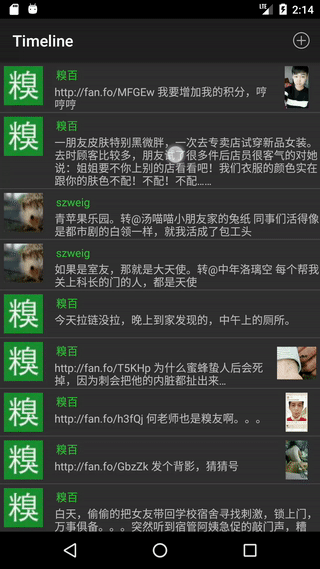
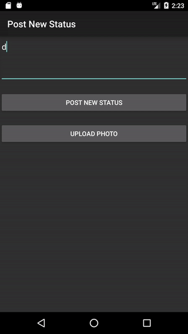

# Fanfou Android Client 别吃了
This is yet another Android Client for Chinese social network Fanfou.com. This English app strips off all the noisy functionality and leaves only the core view and post functions, and thus giving users a more simplistic experience. (NO this is definitely NOT because I am too lasy to write more functions.)

## Login to your account

Users are required to have a pre-registered Fanfou account. You can register here at: [Fanfou](http://fanfou.com/register)

You can either input your username and password, or click on the existing accounts to log in. 

This app (别吃了）does NOT collet your data, whatever that maybe.  

## Pull up to refresh

Refresh your feed by scrolling up

## Scroll down to view the timeline

Scroll down to see what your friends are posting.

## Posting your own status

You can post your own status, photos and texts.

## Or mention your friends

Use @mention to talk with your friends.

## Authors

* **Wenting Zhou**

See also another APP I made: [Bleep](https://github.com/wentingz/Bleep) - an app that automatically bleeps out bad words for you.

## License

This project is licensed under the MIT License.

